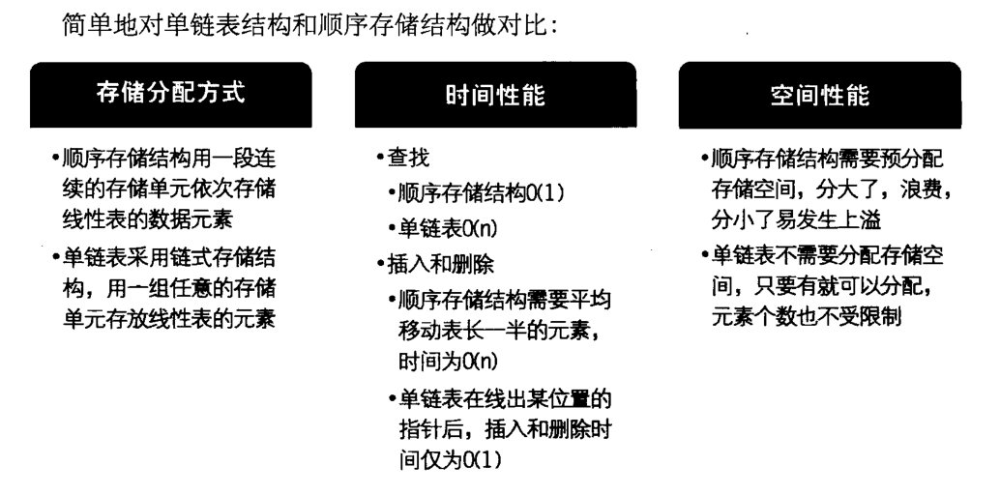
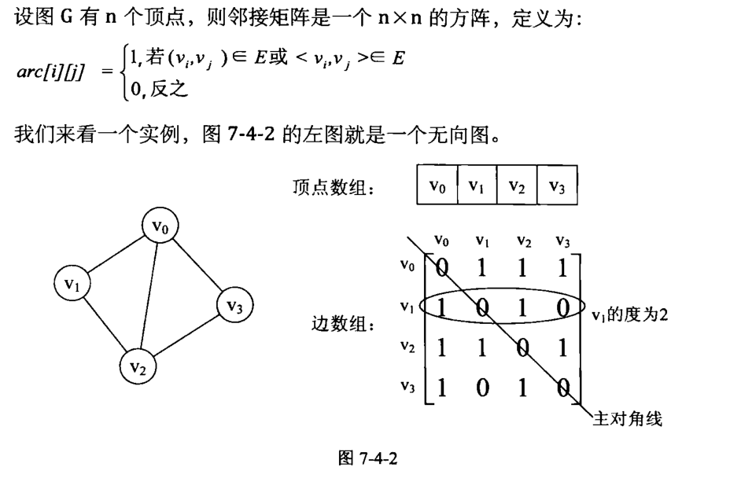
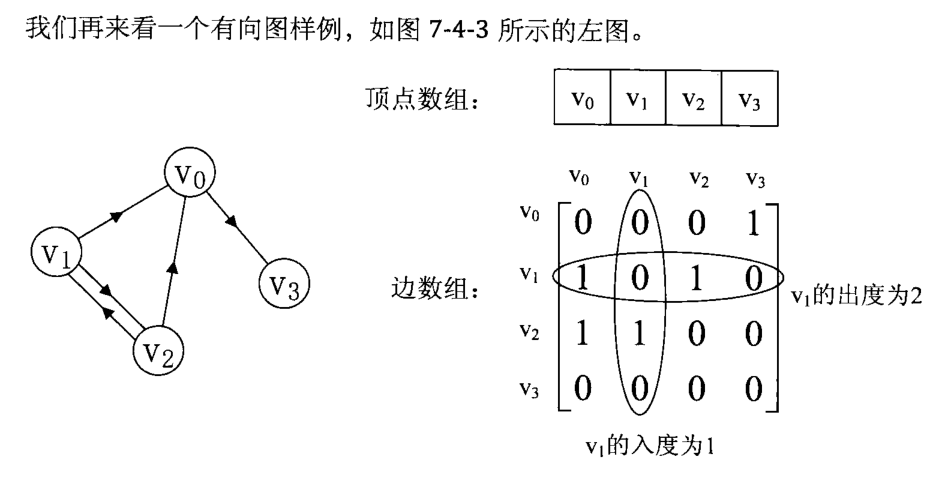
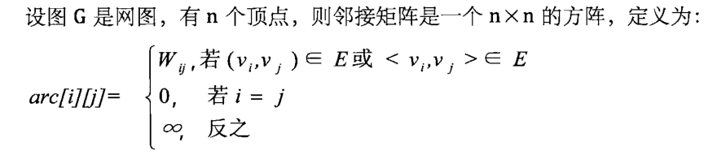
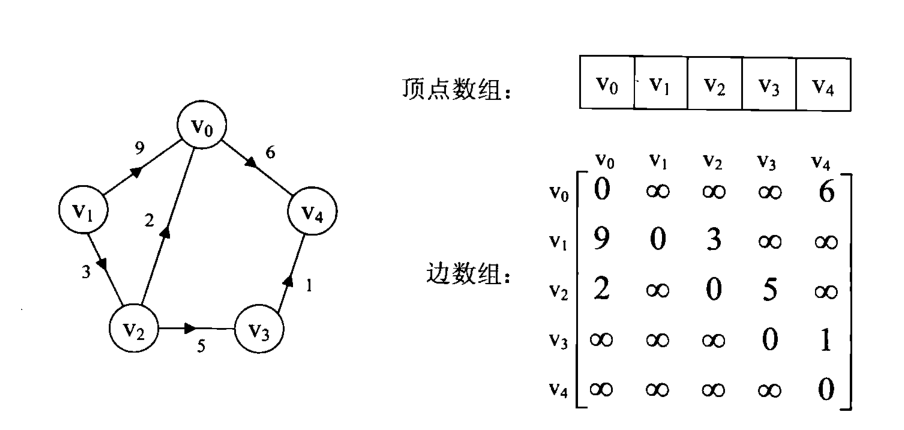
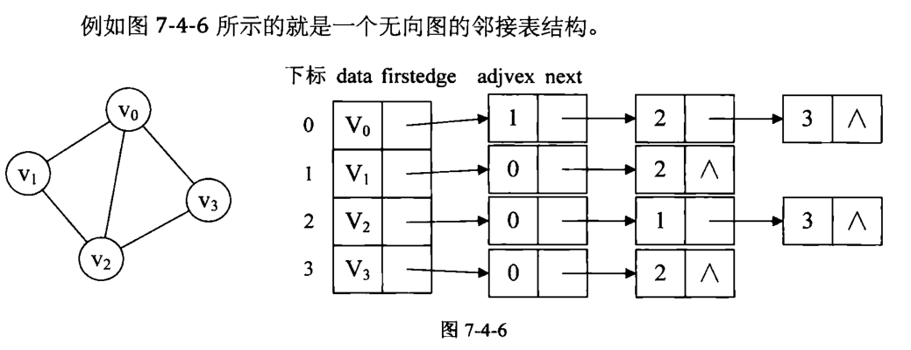
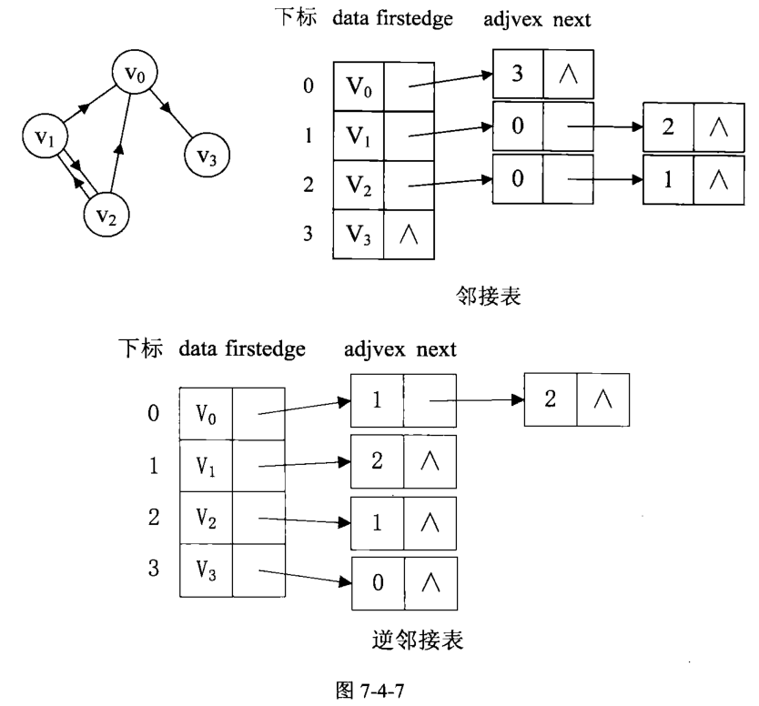
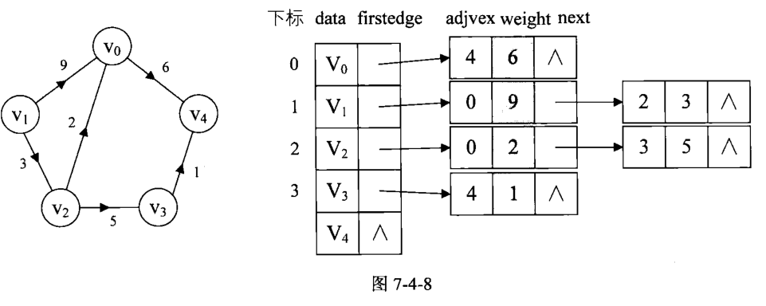
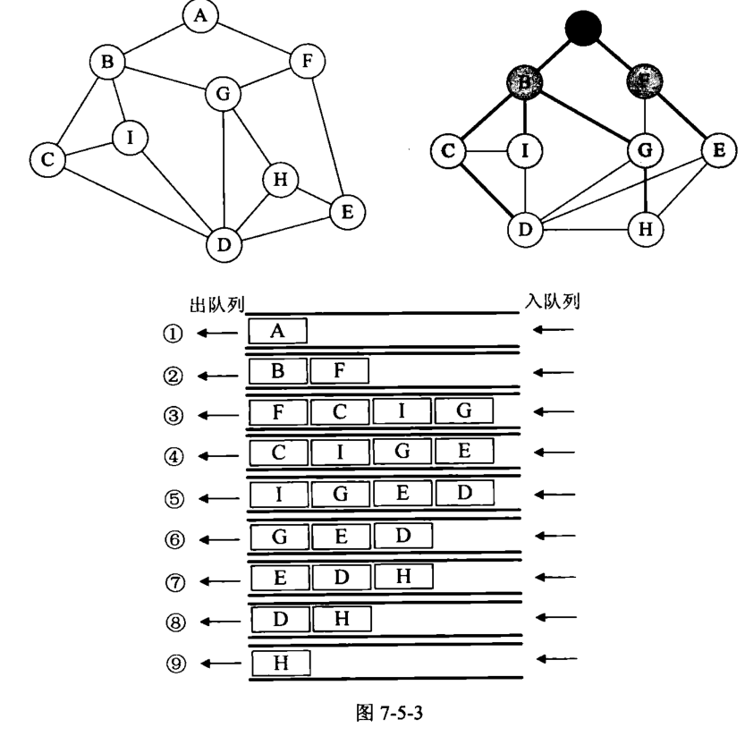

# C/Cplus数据结构实现
   * [C/Cplus数据结构实现]()
      * [线性表](#线性表)
         * [定义](#定义)
         * [顺序存储结构](#顺序存储结构)
            * [顺序存储结构的基本操作](#顺序存储结构的基本操作)
         * [链式存储结构](#链式存储结构)
            * [链式存储结构的基本操作](#链式存储结构的基本操作)
         * [总结](#总结)
      * [栈和队列](#栈和队列)
      * [串](#串)
      * [树](#树)
      * [图](#图)
         - [定义](#定义)
         - [图的存储结构](#图的存储结构)
           - [邻接矩阵](#邻接矩阵)
           - [邻接表存储结构](#邻接表存储结构)

## 线性表

### 定义

**线性表(List)**:零个或多个具有相同数据类型的数据元素的有序序列

通常记为 L = (a1  ,a2,a3,....an)

- a1称为表头元素，an称为表尾元素

- ai-1称为ai的直接前驱，ai+1称为ai的直接后继

- 线性表中所含数据元素的个数称为线性表的长度，n=0时该线性表长度为0

### 顺序存储结构

**顺序存储结构**:线性表的顺序存储结构，指的是用一段地址连续的存储单元依次存储线性表的数据元素。

**数据长度和线性表长度的区别**:

- 数组的长度是存放线性表的存储空间的长度，存储分配后这个量是一般是不变的
- 线性表的长度是线性表中数据元素的个数，随着线性表插入和删除操作的进行，这个量是变化的。
- 在任意时刻，线性表的长度应该小于等于数组的长度。

#### 顺序存储结构的基本操作

**获得元素操作**

对于线性表的顺序存储结构来说，如果我们要实现获取元素操作，即将线性表L中的第i个位置元素值返回，就程序而言，只要i的数值在数组下标范围内，就是把数组第i-1下标的值返回即可。

**插入操作**

插入算法的思路：

1. 如果插入位置不合理，抛出异常；
2. 如果线性表长度大于等于数组长度，则抛出异常或动态增加容量；
3. 从最后一个元素开始向前遍历到第i个位置，分别将它们都向后移动一个位置；
4. 将要插入元素填入位置i处；
5. 表长加1。

**删除操作**

删除算法的思路：

1. 如果删除位置不合理，抛出异常
2. 取出删除元素；
3. 从删除元素位置开始遍历到最后一个元素位置，分别将它们都向前移动一个位置
4. 表长减1。

**线性表顺序存储结构的优缺点**

- *优点:* 无须为表示表中元素之间的逻辑关系而增加额外的存空间，可以快速地存取表中任一位置的元素
- *缺点:* 插入和删除操作需要移动大量元素，当线性表长度变化较大时，难以确定存储空间的容量，造成存储空间的“碎片”

### 链式存储结构

**线性表的链式存储结构:** 是用一组任意的存储单元存储线性表的数据元素，这组存储单元可以是连续的，也可以是不连续的。

**数据域**: 我们把存储数据元素信息的域称为数据域

**指针域**: 把存储直接后继位置的域称为指针域。

**结点**: 由数据域和指针域组成的数据元素的存储映像,称为结点(Node)

**头指针和头结点的区别**:

- 头指针是指链表指向第一个结点的指针，若链表有头结点，则是指向头结点的指针
- 头指针具有标识作用，所以常用头指针冠以链表的名字
- 无论链表是否为空，头指针均不为空。头指针是链表的必要元素
- 头结点是为了操作的统一和方便而设立的，放在第一元素的结点之前，其数据域一般无意义（也可存放链表的长度）
- 有了头结点，对在第一元素结点前插入结点和删除第一结点，其操作与其它结点的操作就统一了
- 头结点不一定是链表必须要素

#### 链式存储结构的基本操作

**获取元素操作**

获得链表第i个数据的算法思路：

1. 声明一个结点p指向链表第一个结点，初始化j从1开始
2. 当j<i时，就遍历链表，让p的指针向后移动，不断指向下一结点，j累加1
3. 若到链表末尾p为空，则说明第i个元素不存在
4. 否则查找成功，返回结点p的数据。

**插入操作**

单链表第i个数据插入结点的算法思路：

1. 声明一结点p指向链表第一个结点，初始化j从1开始
2. 当j<i时，就遍历链表，让p的指针向后移动，不断指向下一结点，j累加1
3. 若到链表末尾p为空，则说明第i个元素不存在
4. 否则查找成功，在系统中生成一个空结点s
5. 将数据元素e赋值给s->data
6. 单链表的插入标准语句s->next=p->nextp->next=s
7. 返回成功

**删除操作**

单链表第i个数据删除结点的算法思路：

1. 声明一结点p指向链表第一个结点，初始化j从1开始
2. 当j<i时，就遍历链表，让p的指针向后移动，不断指向下一个结点，j累加1
3. 若到链表末尾p为空，则说明第i个元素不存在
4. 否则查找成功，将欲删除的结点p->next赋值给q
5. 单链表的删除标准语句p->next=q->next
6. 将q结点中的数据赋值给e，作为返回
7. 释放q结点
8. 返回成功。

**整表创建算法**

单链表整表创建的算法思路：

1. 声明一结点p和计数器变量i

2. 初始化一空链表L

3. 让L的头结点的指针指向NULL，即建立一个带头结点的单链表

4. 循环：

   - 生成一新结点赋值给p
   - 随机生成一数字赋值给p的数据域p->data
   - 将p插入到头结点与前一新结点之间

      

**整表删除算法**

单链表整表删除的算法思路如下：

1. 声明一结点p和q
2. 将第一个结点赋值给p
3. 循环：
   - 将下一结点赋值给q
   - 释放p
   - 将q赋值给p

### 总结

*若线性表需要频繁查找，很少进行插入和删除操作时，宜采用顺序存储结构。若需要频繁插入和删除时，宜采用单链表结构。*

*当线性表中的元素个数变化较大或者根本不知道有多大时，最好用单链表结构，这样可以不需要考虑存储空间的大小问题。*

## 栈和队列

## 串

## 树

## 图

### 定义

**图(Graph)**是由顶点的有穷非空集合和顶点之间边的集合组成，通常表示为：G（V，E），其中，G表示一个图，V是图G中顶点的集合，E是图G中边的集合。

*注意*

线性表中我们把数据元素叫元素，树中将数据元素叫结点，在图中数据元素，我们则称之为顶点（Vertex）

**无向边**：若顶点v；到vi之间的边没有方向，则称这条边为*无向边（Edge）*，用无序偶对（vi,vj）来表示。如果图中任意两个顶点之间的边都是无向边，则称该图为***无向图（Undirected graphs）***。

**有向边**：若从顶点v到的边有方向，则称这条边为有向边，也称为*弧（Arc）*。用有序偶<vi,vj>来表示，vi称为弧尾（Tail），vj称为弧头（Head）。如果图中任意两个顶点之间的边都是有向边，则称该图为**有向图（Directed graphs）**。

*注意*

无向边用小括号“**（）**”表示，而有向边则是用尖括号“**<>**”表示。

**简单图**：在图中，若不存在顶点到其自身的边，且同一条边不重复出现，则称这样的图为**简单图**。

**无向完全图**：在无向图中，如果任意两个顶点之间都存在边，则称该图为**无向完全图**。

**有向完全图**；在有向图中，如果任意两个顶点之间都存在方向互为相反的两条弧，则称该图为**有向完全图**。

**权**：有些图的边或弧具有与它相关的数字，这种与图的边或弧相关的数叫做**权（Weight）**。这些权可以表示从一个顶点到另一个顶点的距离或耗费。这种带权的图通常称为**网（Network）**。

**子图**：假设有两个图G=（V，{E]）和G'=（V'，{E']），如果V'为V的真子集且E'为E的真子集，则称G’为G的**子图(subgraph)**

**邻接**:是两个顶点之间的一种关系。如果图包含（u,v），则称顶点v与顶点u邻接。在无向图中，这也暗示了顶点u也与顶点v邻接。换句话说，在无向图中邻接关系是对称的。

**关联**:是指顶点和边之间的关系。在有向图中，边（u,v）从顶点u开始关联到v，或者相反，从顶点v开始关联到u。在无向图中，边(u,v)与顶点u和v相关联。

**度(Degree)的定义**：顶点 v 的度是和 v 相关联的边的数目，记为TD(v)。

**入度**：以 v 为头的边的数目，记为ID(v)

**出度**：以 v 为尾的边的数目，记为OD(v)

**路径：**依次遍历顶点序列之间的边所形成的轨迹。没有重复顶点的路径称为**简单路径**。路径的长度是路径上的边或弧的数目。

第一个顶点到最后一个顶点相同的路径称为**回路或环（Cycle）**。序列中顶点不重复出现的路径称为**简单路径**。除了第一个顶点和最后一个顶点之外，其余顶点不重复出现的回路，称为**简单回路或简单环**。

若任意两顶点都是连通的，则图就是**连通图**，有向则称**强连通图**。图中有子图，若子图极大连通则就是**连通分量**，有向的则称**强连通分量**。

无向图中连通且n个顶点n-1条边叫**生成树**。有向图中一顶点入度为0其余顶点入度为1的叫**有向树**。一个有向图由若干棵有向树构成**生成森林**。

### 图的存储结构

#### 邻接矩阵

**图的邻接矩阵（Adjacency Matrix）存储方式**是用两个数组来表示图。一个一维数组存储图中*顶点信息*，一个二维数组（称为邻接矩阵）存储图中的*边或弧的信息*。

有了这个矩阵，我们就可以很容易地知道图中的信息。

- 我们要判定任意两顶点是否有边无边就非常容易了。
- 我们要知道某个顶点的度，其实就是这个顶点v；在邻接矩阵中第i行（或第i列）的元素之和。比如顶点v1的度就是1+0+1+0=2。
- 求顶点vi的所有邻接点就是将矩阵中第i行元素扫描一遍，arc[i] [j]为1就是邻接点。

有向图讲究入度与出度，顶点v1的入度为1，正好是第v1列各数之和。顶点v1的出度为2，即第v1行的各数之和。

与无向图同样的办法，判断顶点vi到vj是否存在弧，只需要查找矩阵中arc[i] [j] 是否为1即可。要求vi的所有邻接点就是将矩阵第i行元素扫描一遍，查找arc[i] [j]
为1的顶点。

**缺点**：邻接矩阵是不错的一种图存储结构，但是我们也发现，对于边数相对顶点较少的图，这种结构是存在对存储空间的极大浪费的。

#### 邻接表存储结构

邻接表的处理办法是这样。

1. 图中顶点用一个一维数组存储，当然，顶点也可以用单链表来存储，不过数组可以较容易地读取顶点信息，更加方便。另外，对于顶点数组中，每个数据元素还需要存储指向第一个邻接点的指针，以便于查找该顶点的边信息。
2. 图中每个顶点vi的所有邻接点构成一个线性表，由于邻接点的个数不定，所以用单链表存储，无向图称为顶点vi的边表，有向图则称为顶点vi作为弧尾的出边表。

从图中我们知道，顶点表的各个结点由data和firstedge两个域表示，data是数据域，存储顶点的信息，firstedge是指针域，指向边表的第一个结点，即此顶点的第一个邻接点。边表结点由adjvex和next 两个域组成。adjvex是邻接点域，存储某顶点的邻接点在顶点表中的下标，next则存储指向边表中下一个结点的指针。

若是有向图，邻接表结构是类似的，比如图7-4-7中第一幅图的邻接表就是第二幅图。但要注意的是有向图由于有方向，我们是以顶点为弧尾来存储边表的，这样很容易就可以得到每个顶点的出度。但也有时为了便于确定顶点的入度或以顶点为弧头的弧，我们可以建立一个有向图的**逆邻接表**，即对每个顶点v，都建立一个链接为vi为弧头的表。如图7-4-7的第三幅图所示。

对于带权值的网图，可以在边表结点定义中再增加一个weight的数据域，存储权值信息即可，如图7-4-8所示。

### 图的遍历

**图的遍历**：我们希望从图中某一顶点出发访遍图中其余顶点，且使每一个顶点仅被访问一次，这一过程就叫做**图的遍历（Traversing Graph）**。

**深度优先遍历，也称深度优先搜索，简称DFS**：从图中某个顶点v出发，访问此顶点，然后从V的未被访问的邻接点出发深度优先遍历图，直至图中所有和V有路径相通的顶点都被访问到。若图中尚有顶点未被访问，则另选图中一个未曾被访问的顶点作起始点，重复上述过程，直至图中所有顶点都被访问到为止。

**广度优先遍历（Breadth_First_Search），又称为广度优先搜索，简称BFS**:

